# ChemInteractive (iOS)

A native SwiftUI iPhone app that teaches chemical bonding interactively. Drag two
elements (or a polyatomic ion) together and the app classifies the bond — **ionic**,
**covalent**, or **metallic** — explains the charge derivation, and renders an animated
result diagram: an ionic crossover + Lewis electron‑transfer, a covalent Lewis structure,
or a metallic electron‑sea. Tapping an element opens a detail card (notation, group/
period, electron config, oxidation states) and highlights its group + period; drop
zones are bubbling potion flasks whose fill animates by state of matter (solid/liquid/
gas/aqueous); results show the compound name, a heuristic product state‑of‑matter badge
(solid/liquid/gas), and a tappable bond explanation.

A second use case, **stoichiometry**, layers on top of the bond result. Once a binary
compound forms, a **⚖ Stoichiometry** button clears the diagram and switches to a
calculator: a knob on each flask opens a quantity input (mole or mass), and the balanced
equation (e.g. `2H₂ + O₂ → 2H₂O`) renders as tappable chips. Tapping a reactant chip
shows its role (limiting / excess reagent / stoichiometric) and amount consumed/unreacted;
tapping the product chip shows the theoretical yield. Naturally‑diatomic elements
(H, N, O, F, Cl, Br, I) are auto‑treated as X₂. When both reactants have an amount (or a
unit is switched), a **reaction effect** fires — a synthesised match‑strike sound + a
sparkle burst over the equation.

It is a pure‑Swift port of an existing React + Rust/WASM app. **No WebAssembly, FFI, or JS
bridge ships in the binary** — the chemistry domain logic was ported from the Rust
`pt-domain` crate to native Swift and is verified against the original (see
[Testing](#testing)).

- **Platform:** iOS 17.0+, portrait iPhone.
- **Language:** Swift 5 language mode, SwiftUI.
- **Tests:** 94 in `ChemCore` + 68 in the app target, all command‑line runnable.

---

## Use cases

One actor — the **chemistry student** — drives everything; the app is fully offline with
no external systems. Placing the second element auto-runs classification (`«include»`);
the explanation card, transition-metal charge picker, and stoichiometry calculator are
optional branches off the base flow (`«extend»`).

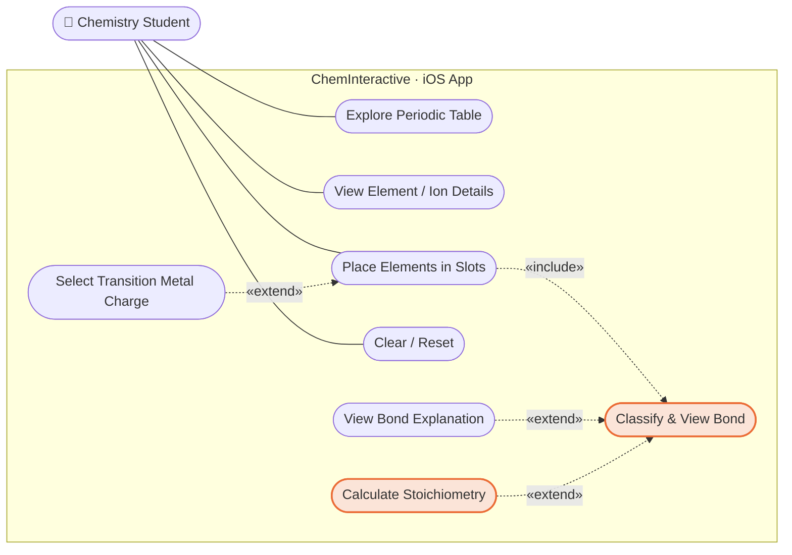

| # | Use case | Trigger | Result |
|---|----------|---------|--------|
| 1 | Explore Periodic Table | Open app, browse/zoom, Elements ↔ Polyatomic tabs | View 118 elements + 6 polyatomic ions |
| 2 | View Element / Ion Details | Tap token | Detail card: notation, config, oxidation states, group/period highlight |
| 3 | Place Elements in Slots | Drag-drop or tap-to-place into Slot A / B | Flask fills; on 2nd token → classify |
| 4 | Clear / Reset | Tap × or Reset | Empty slot / back to selecting |
| 5 | Classify &amp; View Bond | 2nd token placed (incl. of #3) | Ionic crossover · covalent Lewis · metallic sea + compound name |
| 6 | View Bond Explanation | Tap bond label ⓘ (ext. of #5) | Charge-derivation card per slot |
| 7 | Select Transition Metal Charge | Drop a transition metal (ext. of #3) | Oxidation-state picker → feeds bonding |
| 8 | Calculate Stoichiometry | Tap ⚖ from a bond result (ext. of #5) | Balanced eq, limiting/excess reagent, yield + reaction effect |

---

## Architecture

The system is three layers, smallest dependency first:

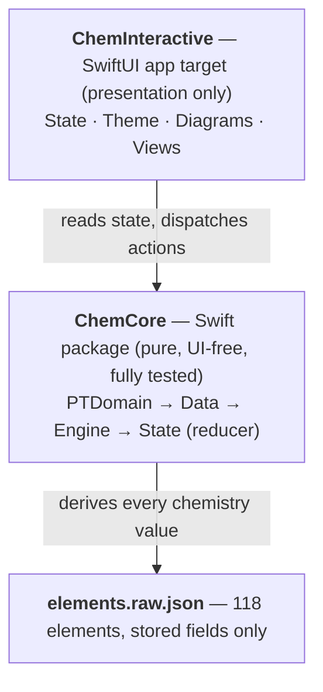

**Why this split.** The chemistry is small, deterministic, and worth testing exhaustively,
so it lives in a standalone Swift Package (`ChemCore`) that builds and tests on macOS with
plain `swift test` — no simulator needed. The app target is a thin, declarative SwiftUI
shell: it never computes chemistry, it only reads `ChemCore`'s state and dispatches actions
into `ChemCore`'s reducer.

The app references `ChemCore` as a **local Swift package** (relative path `ChemCore`) via a
hand‑authored `ChemInteractive.xcodeproj` (Xcode 16 `objectVersion = 70`, file‑system‑
synchronized groups — new source files are auto‑discovered, no `pbxproj` editing).

### Module dependencies

Arrows mean "depends on / imports". `ChemCore`'s internal layers are strictly one‑directional;
the app never reaches past `ChemCore`'s public API.

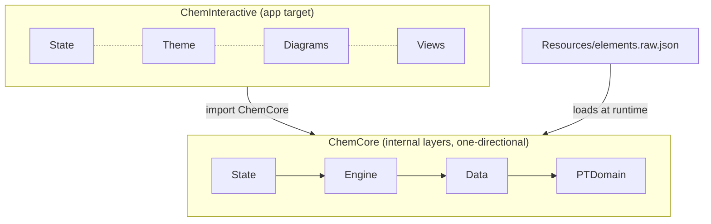

### Unidirectional data flow (Model–View–Update)

The whole app is one loop. A view dispatches an **action**; the model runs it through the
**pure reducer**; the new **state** re‑renders the views. State only ever changes in one
place (`canvasReducer`), so behavior is fully reproducible and testable.

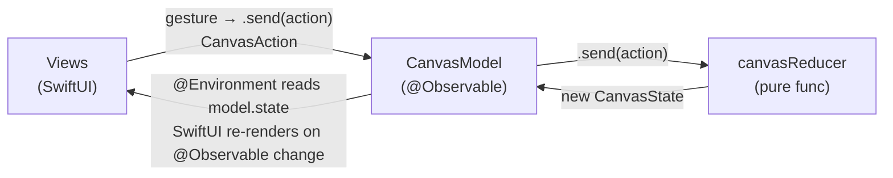

### Repository layout

```
ios-chem-interactive/
├── ChemCore/                       # the domain package (Plan 1)
│   ├── Package.swift
│   ├── Sources/ChemCore/
│   │   ├── PTDomain/               # periodic-table domain (ported from Rust pt-domain)
│   │   ├── Data/                   # raw element model + loader + derived Element
│   │   ├── Engine/                 # bonding pedagogy (valence, stoich, metallic, gcd)
│   │   ├── State/                  # the canvas state machine (pure reducer)
│   │   └── Resources/elements.raw.json
│   └── Tests/ChemCoreTests/        # 93 XCTests incl. golden WASM-fidelity check
├── ChemInteractive/                # the SwiftUI app (Plans 2 & 3)
│   ├── ChemInteractiveApp.swift    # @main, injects the model
│   ├── State/CanvasModel.swift     # @Observable wrapper over the reducer
│   ├── Theme/                      # Theme, IonFormat, PeriodicNaming, CompoundName
│   ├── Diagrams/LewisLayout.swift  # pure diagram geometry (tested)
│   └── Views/                      # Tray/, Zones/, Bridge/, Shared/, ChemCanvasView
├── ChemInteractiveTests/           # XCTests for the app's pure helpers
├── ChemInteractive.xcodeproj/      # hand-authored
├── tools/                          # dev-only Node scripts (data generation)
└── docs/superpowers/{specs,plans}/ # design specs + implementation plans
```

---

## Build & run

```bash
# Domain package alone (fast, no simulator):
cd ChemCore && swift test

# Whole app (build + boot + tests in a simulator):
xcodebuild build -scheme ChemInteractive -destination 'platform=iOS Simulator,name=iPhone 17'
xcodebuild test  -scheme ChemInteractive -destination 'platform=iOS Simulator,name=iPhone 17'

# Launch straight into a diagram (DEBUG builds only — see "Debug preview"):
xcrun simctl launch booted com.cheminteractive.app --args -diagramPreview metallic
```

---

## Layer 1 — `ChemCore` (the domain package)

Pure value types and free functions. Everything is derived from an element's atomic number
plus its stored raw data; nothing about bonding is hard‑coded per element.

### `PTDomain/` — periodic‑table domain

A faithful Swift port of the Rust `pt-domain` crate. Its test vectors are translated 1:1
into XCTest.

| Feature | Implementation | File |
| --- | --- | --- |
| Subshells & orbitals | `enum Subshell { s, p, d, f }` with `azimuthal`/`capacity`/`orbitalCount`/`label`; `struct Orbital { n, subshell, electrons }` | `PTDomain/Subshell.swift` |
| Aufbau fill | `aufbauFill(_ z:) -> [Orbital]` walks a hard‑coded **Madelung (n+l) order** table, filling each subshell to capacity | `PTDomain/Aufbau.swift` |
| Validation | `validate(_ z:)` throws `DomainError.invalidAtomicNumber` outside `1...118` | `PTDomain/DomainError.swift` |
| Electron configuration | `electronConfiguration(_ z:) throws -> ElectronConfiguration` = naive Aufbau **+ a ground‑state anomaly table** (Cr, Cu, Nb, Mo, Ru, Rh, Pd, Ag, La, Ce, Gd, Pt, Au, Ac, Th, Pa, U, Np, Cm). Provides `description` (e.g. `"1s2 2s2 2p6 3s2 3p6 3d6 4s2"`), `unpairedElectrons` (Hund's rule), `electrons(in:_:)` | `PTDomain/ElectronConfiguration.swift` |
| Placement | `block`, `period`, `group` (1–18; f‑block → 3 by convention) derived from the configuration | `PTDomain/Classification.swift` |
| Chemistry classification | `category` (10 categories), `elementClass` (`Metal`/`NonMetal`/`Metalloid`), `oxidationStates(_ z:)` — all heuristics over group/block/atomic number | `PTDomain/Classification.swift` |
| Physical calc | `atomicMassFromIsotopes` (abundance‑weighted mean), `isotopeMassMatches`, `stateAt(meltingPoint:boilingPoint:temperatureK:)` | `PTDomain/Calc.swift` |

**Intentional bug fix vs. the React source:** React's `makeZoneState` set
`isTransition = el.block === 'd'`, but the data emits block `"D"` (uppercase), so it was
always `false`. The Swift port uses a `Block` enum and `isTransition = (block == .d)`, so
d‑block elements correctly trigger the transition‑metal charge picker.

### `Data/` — element data

| Feature | Implementation | File |
| --- | --- | --- |
| Raw record | `struct RawElement: Decodable` mirrors the stored fields (atomic number, symbol, masses, melting/boiling points, electronegativity, isotopes…). `decodeAll(from:)` uses `.convertFromSnakeCase` | `Data/RawElement.swift` |
| Derived element | `struct Element` wraps a `RawElement` and computes `block`, `period`, `group`, `category`, `elementClass`, `oxidationStates`, `electronConfiguration`, `computedAtomicMass` at init via `PTDomain` | `Data/Element.swift` |
| Loader | `PeriodicTable.load()` reads the bundled `elements.raw.json` (118 elements) and builds all `Element`s, sorted by atomic number; `bySymbol(_:)`, `byAtomicNumber(_:)` | `Data/PeriodicTable.swift` |
| Data file | `elements.raw.json` — stored fields only, generated from 118 canonical YAML files by `tools/yaml-to-raw-json.mjs` (dev‑time) | `Resources/elements.raw.json` |

### `Engine/` — bonding pedagogy

The teaching logic that lives in the React app (not in Rust). All pure functions.

| Feature | Implementation | File |
| --- | --- | --- |
| Valence electrons | `parseValenceElectrons(config:group:)` strips a noble‑gas prefix, sums the electrons in the highest principal shell (with a group‑based fallback) | `Engine/Valence.swift` |
| Bond classification | `determineBonding(_:_:)` + `bondingType(…)` (see decision tree below); `reactionGlyph(for:) -> String` maps the classified `BondingType?` to the bridge arrow (`nil` → `+`, ionic/metallic → `→` go‑to‑completion, covalent → `⇌` equilibrium) | `Engine/Bonding.swift` |
| Covalent stoichiometry | `calcStoich(veA:veB:) -> (nA, nB, bondOrder)` from octet/duet bonds‑needed and their gcd; `covalentStoich(veA:groupA:periodA:veB:groupB:periodB:)` wraps it with the **orbital‑mismatch rule** (below); `isOrbitalMismatchDoubleBond(…)` is the rule predicate; `iupacFirst(_:_:)` orders binary formulas by electronegativity | `Engine/CovalentStoich.swift` |
| Metallic count | `metallicElectronCount(veA:veB:poolSize:)` = `min(3·veA + 3·veB, 12)` delocalised electrons | `Engine/Metallic.swift` |
| Product state | `predictProductState(bonding:a:b:) -> ProductState` — **heuristic** standard‑state of the product: ionic/metallic → solid; covalent estimated from constituents' `stateOfMatter` (any gas → gas, else any liquid → liquid, else solid; H₂O special‑cased liquid). Approximate, for the result badge | `Engine/ProductState.swift` |
| Stoichiometry | `balanceEquation(subscriptA:molecularityA:subscriptB:molecularityB:)` finds smallest‑integer coefficients for `aA_p + bB_q → cAₓBᵧ` (rebalancing for diatomic X₂); `solveStoichiometry(a:b:)` takes two `ReactantSpec`s (atomic mass, product subscript, diatomic flag, optional `ReactantEntry` of mole/mass) and returns a `StoichResult` (balanced equation, limiting side, theoretical `yield`, `excess`, diatomic notes). `naturallyDiatomic` is the 7‑element set; blank entry = "enough" | `Engine/Stoichiometry.swift` |
| Math | `gcd(_:_:)` (Euclidean) | `Engine/MathUtil.swift` |

**Orbital‑mismatch double‑bond rule** (`covalentStoich` / `isOrbitalMismatchDoubleBond`). Two
non‑metals of the **same group but different periods** that the octet rule would pair as a
**1:1 double bond** instead resolve to a one‑central + two‑peripheral XO₂ structure — their
orbitals differ in size and can't overlap efficiently for a simple double bond, so the larger
atom (higher period) goes central with two of the smaller atom around it. The "1:1 double
bond" trigger is only satisfiable by valence‑6 (Group 16) atoms, so the rule fires for e.g.
**S + O → SO₂** (S central, ×2 O) and **Se + S → SeS₂** but is automatically off for halogens
(single bond), Group 15 (triple), same‑period pairs like O₂, and different‑group pairs like
CO₂ — no hard‑coded group check. Off‑rule cases fall straight through to `calcStoich`.

**Bond classification decision tree** (`bondingType`, evaluated on the second drop):

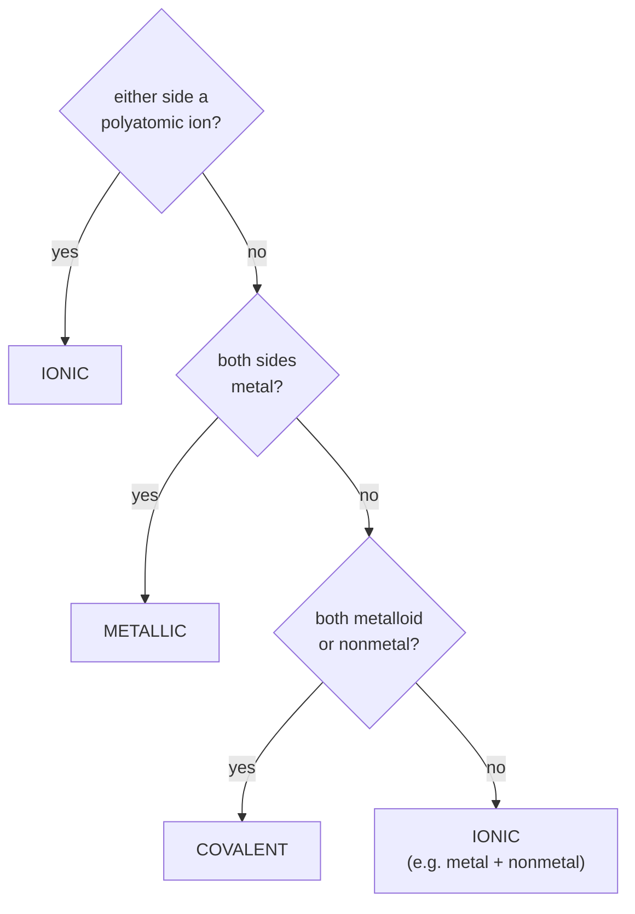

### `State/` — the canvas state machine

A pure value‑type reducer mirroring the React `reducer.ts`. **No reference types, no side
effects** — the same input always yields the same output, which is what makes it
exhaustively testable.

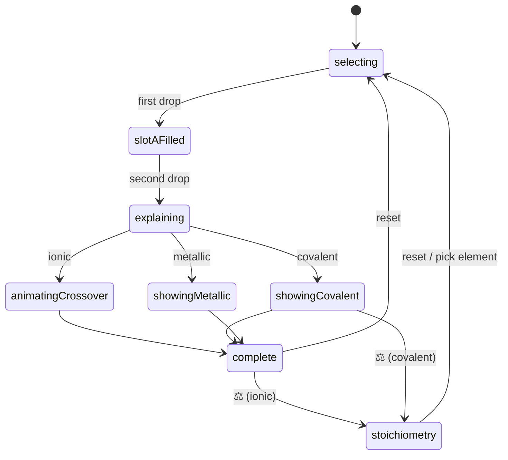

| Type / function | Role | File |
| --- | --- | --- |
| `CanvasPhase` | `selecting → slotAFilled → explaining → animatingCrossover / showingCovalent / showingMetallic → complete`, plus `stoichiometry` (the calculator use case) | `State/Phase.swift` |
| `Slot` | `.a` / `.b`, with `.other` | `State/Phase.swift` |
| `ZoneStatus` | `.neutral` / `.deducing` / `.ionized` | `State/Phase.swift` |
| `ZoneState` | a filled slot: symbol, `elementClass`, `isPolyatomic`, `isTransition`, `valenceElectrons`, `oxidationStates`, `derivedCharge`, `status`, `group`, `period`, `stateOfMatter`. Built from an `Element` (carries `group`/`period`/`stateOfMatter`) or a `PolyatomicIon` (defaults). `group`/`period` feed the orbital‑mismatch rule; `stateOfMatter` feeds the product‑state badge | `State/ZoneState.swift` |
| `PolyatomicIon` | the 6 hard‑coded ions (OH⁻, NO₃⁻, SO₄²⁻, CO₃²⁻, PO₄³⁻, NH₄⁺) | `State/PolyatomicIon.swift` |
| `CanvasState` | `{ canvasPhase, bondingType?, slotA?, slotB? }`, plus `.initial` | `State/CanvasState.swift` |
| `CanvasAction` | `dropElement(slot:zone:)`, `pickTMCharge(slot:charge:)`, `dismissExplanation`, `replaceElement(slot:)`, `crossoverComplete`, `startStoichiometry`, `reset` | `State/CanvasState.swift` |
| `canvasReducer(_:_:)` | the pure transition function. Auto‑ionises ionic pairs on drop, routes transition metals to a `.deducing` charge picker, blocks `dismissExplanation` while a slot is still deducing, restarts when a third token is dropped on two filled slots. `startStoichiometry` moves `.complete` (ionic) or `.showingCovalent` to `.stoichiometry`, preserving the slots — the one state‑machine touch the stoichiometry feature needs | `State/CanvasReducer.swift` |

---

## Layer 2 — `ChemInteractive` (the SwiftUI app)

The app adds **zero** chemistry. It wraps `ChemCore`'s reducer in an observable model,
maps state to SwiftUI views, and maps gestures to actions.

### State & data flow

`State/CanvasModel.swift` — `@Observable final class CanvasModel`:

```swift
@Observable final class CanvasModel {
    private(set) var state: CanvasState = .initial
    let elements: [Element]                 // 118, from PeriodicTable.load()
    let polyatomicIons = PolyatomicIon.polyatomicIons
    private(set) var selectedToken: TokenTransfer?
    var quantityA, quantityB: ReactantEntry? // stoichiometry input (UI-only, never in CanvasState)

    func send(_ action: CanvasAction) { state = canvasReducer(state, action); /* clears quantities on a new reaction */ }
    func place(_ token: TokenTransfer, in slot: Slot) { … }   // resolve → drop → clear selection
    func zoneState(for token: TokenTransfer) -> ZoneState?    // rebuild a ZoneState via ChemCore
    func select(_:) / clearSelection()      // select() resets to bonding when in .stoichiometry
}
```

- **Stoichiometry is derived, not stored.** `CanvasModel+Stoichiometry.swift` adds computed
  `stoichResult` / `productFormula` and `reactantOutcome(for:)` (consumed + unreacted per slot)
  by reusing the existing product subscripts (`crossoverModel` for ionic, `covalentStoich` for
  covalent) and calling `solveStoichiometry`. Quantities (`quantityA`/`quantityB`) are transient
  UI state — they reset whenever a new reaction starts (phase back to `selecting`/`slotAFilled`),
  so a previous reaction's amounts never leak.

- The model owns element loading and is injected once at the app root
  (`ChemInteractiveApp.swift`: `@State private var model = CanvasModel()` →
  `.environment(model)`); every view reads it with `@Environment(CanvasModel.self)`.
- **`TokenTransfer { symbol, isPolyatomic }`** is the drag/tap payload — `Codable` +
  `Transferable` (JSON representation). It carries only what's needed to *rebuild* a
  `ChemCore.ZoneState` via the model, so `ZoneState` construction stays in `ChemCore` and is
  never duplicated in the app.

**Dropping a token — the round trip** (drag *and* tap‑to‑place share the same path):

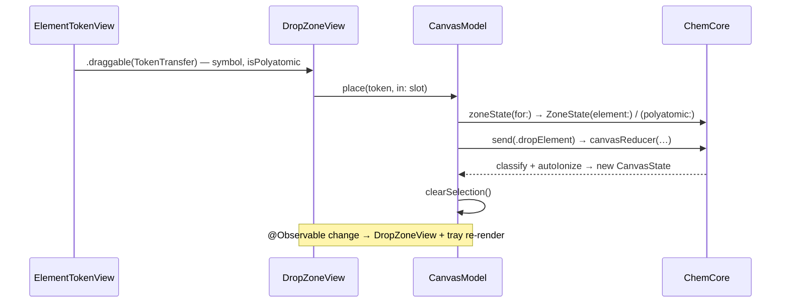

### Theme & formatting

| Feature | Implementation | File |
| --- | --- | --- |
| Palette | `enum Theme` (`bg #1a0a2e`, `cation #00ff88`, `anion #ff4080`, `accent #7040ff`, `surface`, `muted`, `text`), `Color(hex:)`, category/class/orbital color maps — exact values ported from `index.css` / `elementColor.ts` | `Theme/Theme.swift` |
| Bond hints | `bondHint(firstClass:firstIsPolyatomic:tokenClass:tokenCategory:) -> BondHintKind` (`.ionic`/`.covalent`/`.metallic`/`.none`) drives the tray tint shown after the first drop; noble gases → `.none` (disabled) | `Theme/Theme.swift` |
| Ion text | `superscript(_:)`, `subscriptGlyphs(_:)`, `formatIon(symbol:charge:)` (e.g. `"Mg²⁺"`), `ionicFormula(…)` (gcd‑reduced, parenthesises polyatomic anions: `Ca(OH)₂`), `chargeExplanation(_:)`, `electronsNeeded(_:)` | `Theme/IonFormat.swift` |

> Note: `Category` is qualified as `ChemCore.Category` where it appears, because the iOS 17
> SDK also defines several `Category` types — a bare reference is ambiguous.

### Views

**Root — `Views/ChemCanvasView.swift`.** A `GeometryReader` lays out the tray on top
(~45% height) and the workspace below (`Slot A | Bridge | Slot B` in an `HStack`), with the
explanation modal as a full‑screen `.overlay`.

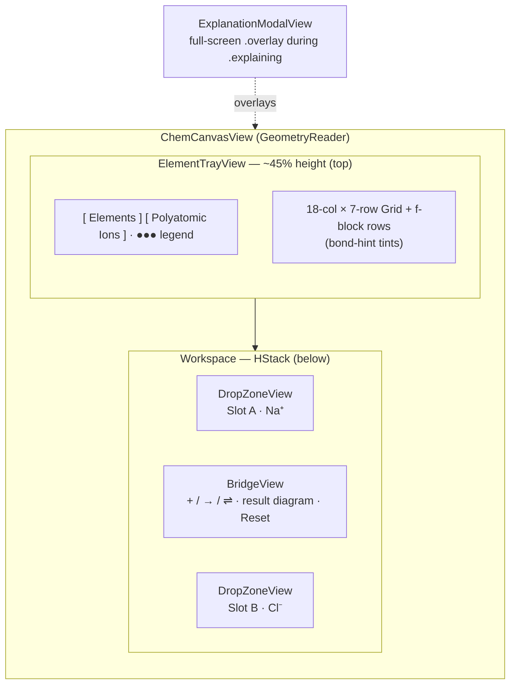

**Tray — `Views/Tray/`:**

- `ElementTrayView` — the full periodic table as an 18‑column × 7‑period `Grid`
  (empty cells where no element sits) plus f‑block rows, "Elements" / "Polyatomic
  Ions" tabs, bonding legend, and per‑token hint tints against the single filled
  slot. **Fit‑to‑frame**: `TrayLayout.trayCellMetrics(...)` (pure, tested) sizes
  every cell from the available area so the whole table fits with no horizontal
  scroll; **pinch‑zoom** (1–4×, double‑tap resets) magnifies to read small symbols.
- `ElementTokenView` / `PolyatomicTokenView` — a tappable token. **Tapping selects
  it** (`model.select`) *and* opens the detail card — placement is then a single
  tap on a slot (two taps total). Drag still works from the detail card's glyph.
  The selected element's **group column + period row highlight** in the grid
  (accent wash + ring) while its card is open.
- `ElementDetailCard` / `PolyatomicDetailCard` (`ElementDetailCard.swift`) — a
  **non‑modal** popup (shared `Views/Shared/CardChrome` with `blocking: false`, so
  a slot tap passes through to place). Shows the atom in standard notation (mass
  super‑, atomic sub‑script), name, class, category, `Group N/Name` +
  `Period N` (`Theme/PeriodicNaming.periodicGroupName`), electron configuration
  (superscripted counts, wrapped to a group‑name‑driven width), and oxidation
  states. Closing clears the selection (which auto‑dismisses the card).

**Zones — `Views/Zones/`:**

- `DropZoneView` — a slot rendered as a **bubbling potion flask**
  (`PotionFlask.swift`: `PotionFlaskShape` round‑bottom flask + `PotionBubbles`
  time‑driven rising bubbles), with an accent glow halo behind the bulb. Accepts a
  drop via `.dropDestination(for: TokenTransfer.self)` → `model.place(token, in: slot)`;
  a pending tap‑selection places by tapping the zone. Empty + idle shows a `sparkles`
  icon; with a pending selection it shows the symbol + a `hand.tap` cue; a filled slot
  shows the element symbol centered in the bulb. A `×` clear button dispatches
  `.replaceElement`. Slot A cation‑green, Slot B anion‑pink; `.contentShape`/gestures
  bound to the flask. In the `.stoichiometry` phase a **knob** (slider icon) on the flask
  neck opens that reactant's quantity popover, and the entered amount renders inside the bulb.
- `SubstanceFill` (`SubstanceFill.swift`) — the occupied‑slot fill, animated by
  state of matter (`resolveSubstanceState`: element `raw.state`, ions → aqueous):
  **solid** chunk drops + settles, **liquid** rises with a wave, **gas** bubbles
  rise (`TimelineView`+`Canvas`), **aqueous** liquid + dispersing dots. Tinted by
  `elementClassColor`; clipped to the flask (`PotionFlaskShape`); restarts on element change.
- `TransitionMetalPickerView` — a button per positive oxidation state; tapping dispatches
  `.pickTMCharge`. Rendered inline in the explanation modal when a slot is `.deducing`.

**Bridge (the result column) — `Views/Bridge/`:**

- `ExplanationModalView` — the per‑bond charge‑derivation modal. For ionic it shows a
  per‑slot panel (TM picker when deducing, else the charge explanation) plus the
  explanation; "Apply →" dispatches `.dismissExplanation` (disabled while any slot is deducing).
- `BondingExplanation.swift` — one shared, pure source of bond wording
  (`bondingTitle`, `bondingExplanation`, `covalentPairSummary`, `orbitalMismatchNote`),
  used by both the modal and the result card. Ionic states per‑ion electron transfer
  with the oxidation‑state charges, then the criss‑cross to the formula. Covalent appends
  `orbitalMismatchNote` — a same‑group/different‑period sentence (e.g. for SO₂) — when the
  orbital‑mismatch rule fires, else `""`.
- `BondTypeLabel` + `BondingInfoCard` — the bond‑type label on each result diagram
  ("IONIC/COVALENT/METALLIC BOND" + ⓘ) is tappable; it opens `BondingInfoCard`
  (full‑screen via `CardChrome`) explaining the bond (covalent shows bonding/lone
  pairs from `covalentLayout`).
- Result **compound name** (`Theme/CompoundName.swift`): `ionicCompoundName`
  (e.g. "Iron(III) oxide", "Ammonium chloride") and `covalentCompoundName`
  (Greek prefixes + elision, e.g. "Carbon dioxide", "Dinitrogen tetroxide") shown
  above each diagram.
- `BridgeView` — the **phase router**. Shows a **reaction‑type‑driven bridge arrow**
  (`reactionGlyph(for: state.bondingType)` — `+` before classification, `→` for ionic/
  metallic, `⇌` for covalent — cross‑fading on change) and switches on
  `state.canvasPhase` to render the right result view (formula + name **above** the
  Lewis‑dot diagram, consistently). The ionic `.complete` and covalent `.showingCovalent`
  views carry the **⚖ Stoichiometry** button (`startStoichiometry`); the `.stoichiometry`
  phase renders the result equation panel. Reset buttons (`ResetButton.swift`) dispatch `.reset`.
- `ProductStateBadge` (`ProductStateBadge.swift`) — a small pill under each result's
  compound name showing `ChemCore.predictProductState` (solid/liquid/gas). The state is
  a tiny **kinetic‑theory particle animation** with no text (`StateParticles`: solid =
  lattice vibrating in place, liquid = packed particles flowing, gas = few bouncing
  freely), tinted per state. Wired into all three result views (ionic in `BridgeView`,
  covalent in `CovalentLewisView`, metallic in `MetallicSeaView`).

**Stoichiometry views — `Views/Bridge/` (the `.stoichiometry` phase):**

- `StoichResultPanel` — renders the balanced equation as a row of tinted **chips**; each
  reactant and the product is a button anchoring its detail popover (chips, not underlines,
  signal interactivity). Long equations scale/clip to one line.
- `ReactantQuantityPopover` — the flask‑knob input: a decimal‑pad numeric field (auto‑focused,
  focus ring, ≥48pt tap target) with a `mol`/`g` segmented unit on its own line; narrow so it
  can't cover the other flask. Writes a `ReactantEntry?` (nil when blank/invalid).
- `ReactantDetailPopover` — a symbol badge + role pill (**Limiting reagent / Excess reagent /
  Stoichiometric**), `Consumed` and (when in excess) `Unreacted` metric rows, and a diatomic
  banner. Reads `model.reactantOutcome(for:)`.
- `ProductDetailPopover` — a formula badge + "Product" pill, the `Yield` metric row, and a
  "stoichiometric ratio" banner when neither reactant limits.
- `StoichMetricRow` — the shared icon‑led `mol` (emphasised) + `g` (muted) amount row used by
  both detail popovers.
- `ReactionBurst` (`ReactionBurst.swift`) + `SoundFX` (`Theme/SoundFX.swift`) — the **reaction
  effect**. `BridgeView` watches a units‑keyed signal (so it fires when both amounts are first
  set *and* when a unit is switched, but not on every keystroke) and calls `fireReaction()`:
  a brief scale pulse + `ReactionBurst` (expanding ring + sparkles flying outward) over the
  equation, plus `SoundFX.reaction()` — a **runtime‑synthesised match‑strike** (scratchy strike
  → igniting flare + crackles via `AVAudioEngine`, no bundled audio) and a success haptic.

In `.stoichiometry`, `ChemCanvasView` relays out the workspace: the two flasks sit **side by
side** with the result panel **full width** below, so the equation has room.

### Cation/anion ordering

A single shared `ionicPair(_:_:)` (in `Diagrams/LewisLayout.swift`) decides which slot is
the cation: by `derivedCharge` sign when known, else the Metal/Metalloid is the cation. It
is used by `ExplanationModalView`, `BridgeView`, `CrossoverAnimatorView`, and
`BondingDiagramView` so the polarity is consistent everywhere.

---

## Layer 3 — the result diagrams

When a bond completes, `BridgeView` routes to one of three animated diagrams. All diagram
*geometry that has a correct answer* (counts, central‑atom choice, subscripts, lone‑pair
counts) lives in a pure, **unit‑tested** helper file; the views are thin renderers over it.
Pixel positions and animation timing are deliberately approximate.

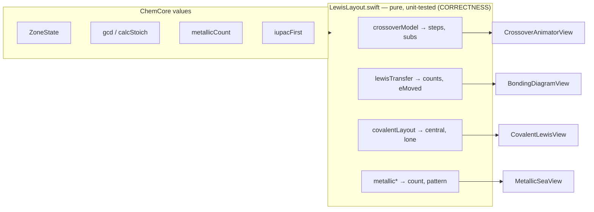

The views are thin renderers (PIXELS: approximate) over the tested geometry.

### `Diagrams/LewisLayout.swift` — the tested geometry spine

| Helper | Returns | Used by |
| --- | --- | --- |
| `ionicPair(_:_:)` | which slot is cation/anion | all ionic views |
| `crossoverModel(cation:anion:)` | reduced subscripts, `showBrackets`/`showGcd`, and the **ordered animation steps** (`isolate → crisscross → [brackets] → [÷gcd] → done`) | `CrossoverAnimatorView` |
| `lewisTransfer(cation:anion:)` | `cCount`, `aCount`, `eMoved`, `anionAfterDots` (capped at 8) | `BondingDiagramView` |
| `dotPositions(_ n:)` | the 8‑slot Lewis dot ring (first `min(n,8)`) | atom rendering |
| `covalentLayout(slotA:slotB:)` | `centralIsA`, `nPeripheral`, `bondOrder`, `centralLone`, `peripheralLone` via `covalentStoich` (central = smaller count, or the larger‑period atom when the orbital‑mismatch rule fires; lone pairs from `(ve − bondOrder·n)/2`) | `CovalentLewisView` |
| `peripheralPositions(_:center:distance:)` | atom centres for 1–4 peripherals (5+ collapses to one + an `×N` badge) | `CovalentLewisView` |
| `lonePairAngles(bondAngles:count:)` | `count` of the 8 cardinal/diagonal directions farthest from the bonds | `CovalentLewisView` |
| `metallicIonIndexPattern` / `metallicElectronsShown(_:_:)` | the `[0,1,0,1,0,1]` A/B lattice pattern and the delocalised‑electron count | `MetallicSeaView` |

Each of these is exercised by `ChemInteractiveTests/LewisLayoutTests.swift` with named
vectors (NaCl, MgCl₂, Al₂O₃, CaCO₃, Mg(OH)₂, CO₂, SO₂, H₂O, N₂, Na/Mg/Al metallic).

**Crossover animation steps** (`crossoverModel.steps`; bracket/÷gcd frames appear only when
relevant — e.g. Mg(OH)₂ gets brackets, CaCO₃ gets ÷gcd, NaCl gets neither):

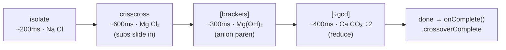

### The four views (`Views/Bridge/`)

| Phase | View | How it's drawn |
| --- | --- | --- |
| `.animatingCrossover` | `CrossoverAnimatorView` | Renders the two symbols with subscripts that animate in. A `.task` steps an index through `crossoverModel.steps` with `withAnimation` and `Task.sleep`; brackets fade in, a `÷g` badge flashes. **Calls `onComplete()` (→ `.crossoverComplete`) unconditionally at the end** so the machine can never softlock. A defensive `else` in `BridgeView` advances the phase even in the impossible nil‑slot case. |
| `.complete` (ionic) | formula text + `BondingDiagramView` | Lewis electron‑transfer for two regular elements (Before: atoms with valence dots; an `Ne⁻ →` arrow; After: charged ions with coefficients and the anion's filled, bracketed octet). Falls back to a simpler charged‑ion view if either is polyatomic. Composed `Circle`/`Text`/`offset` — `AtomCircleView`. |
| `.showingCovalent` | `CovalentLewisView` | All atoms, bonds (`Path`), shared‑pair dots, and lone‑pair dots are positioned with `.position(…)` inside **one** 280×220 `ZStack` (helpers return bare `Group`s so every position resolves in the same coordinate space). Formula ordered by `iupacFirst`. Under the compound name a caption appears **only** when the orbital‑mismatch rule fires (two Group‑16, different‑period atoms) — e.g. "Group 16 orbital mismatch · S central, two O"; otherwise no caption. |
| `.showingMetallic` | `MetallicSeaView` | A 3×2 orange cation lattice; the delocalised electrons drift continuously via **`TimelineView(.animation)` + `Canvas`**, each electron on a smooth periodic path with a per‑electron phase offset. |

### Debug preview

`DEBUG` builds accept a launch argument that seeds any diagram state by **replaying real
reducer actions** (so it can't drift from production behavior):

```bash
# seed a result diagram (crossover | ionic | mgcl2 | na2o | explainIonic | covalent | co2 | metallic | stoich)
xcrun simctl launch booted com.cheminteractive.app --args -diagramPreview mgcl2
# open an element's detail card (any symbol) for screenshots
xcrun simctl launch booted com.cheminteractive.app --args -detailElement Fe
```

`-diagramPreview` is a `#if DEBUG` extension on `CanvasModel` (`debugSeed(_:)`,
`debugPreviewArgument(_:)`) invoked from a `.task` in `ChemInteractiveApp` —
it replays real reducer actions so it can't drift from production. `mgcl2`/`na2o`
exercise the ionic anion/cation coefficients; `co2` the covalent `×N` count;
`explainIonic` stops at the explanation modal; `stoich` lands in the stoichiometry
calculator (covalent H₂O) with sample quantities set. `-detailElement` is a `#if DEBUG`
hook in `ElementTrayView` that opens the detail card. All compiled out of Release.

---

## The phase flow, end to end

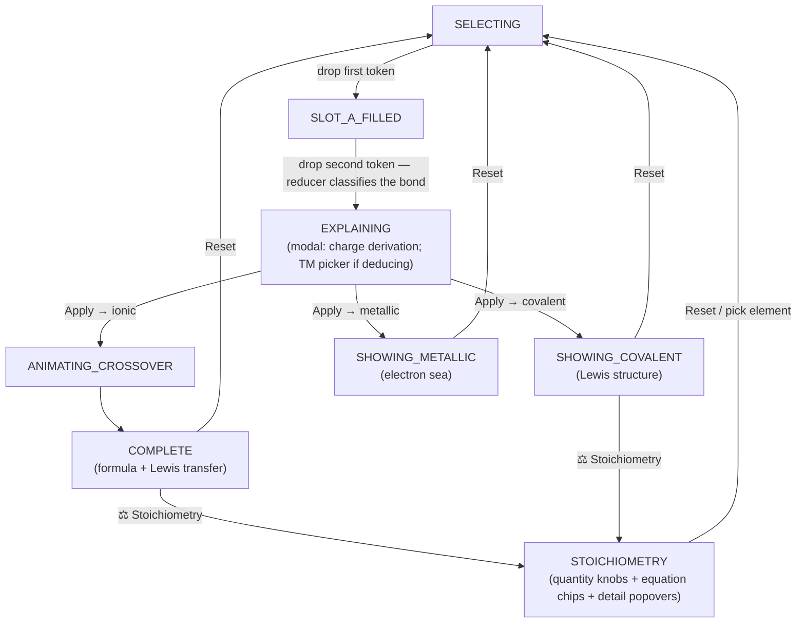

Every transition is a pure `canvasReducer` call; the views only *render* the current
`CanvasPhase` and *dispatch* actions.

---

## Testing

| Suite | Count | What it proves |
| --- | --- | --- |
| `ChemCore` PTDomain/Engine/State | 94 | electron configuration (incl. anomalies), block/period/group/category/class/oxidation states, atomic mass, every reducer transition (incl. `startStoichiometry`), valence/bonding/metallic math, the reaction‑glyph mapping (`+`/`→`/`⇌`), the covalent orbital‑mismatch rule (SO₂/SeS₂ + ClF/NP/O₂/CO₂ negatives), ZoneState group/period, product‑state heuristic, and stoichiometry (equation balancing for H₂O/NaCl/MgCl₂, limiting reactant, theoretical yield, excess, diatomic handling) |
| **Golden fidelity** (`GoldenFidelityTests`) | — | for **all 118 elements**, every Swift‑computed derived field matches the original WASM's output (`elements.golden.json`, generated once by `tools/dump-elements.mjs`) |
| App `LewisLayoutTests` | 14 | the diagram geometry counts (crossover subscripts/steps, Lewis transfer counts, covalent central/lone‑pair counts incl. the SO₂ orbital‑mismatch layout, metallic count/pattern) |
| App `CompoundNameTests`, `BondingExplanationTests` | — | covalent compound naming + bond wording, incl. the SO₂ orbital‑mismatch name ("Sulfur dioxide") and explanation sentence |
| App `CanvasModelTests`, `ThemeTests`, `IonFormatTests`, `SmokeTests` | 22 | the model round‑trips actions through the reducer; exact theme hex values + bond‑hint logic; ion formatting strings; ChemCore links and bundled data loads |

**What is *not* unit‑tested:** the SwiftUI views' pixels and animation. Those are verified by
`xcodebuild` compilation, a simulator boot/render gate, and screenshots (the `-diagramPreview`
argument makes each diagram screenshottable). Final confirmation of the live drag‑and‑drop +
animation flows is a manual pass in the simulator.

---

## Notable Swift / SwiftUI design choices

- **Pure value‑type state machine.** `CanvasState` + `canvasReducer` are structs and free
  functions — no `ObservableObject`, no shared mutable state in `ChemCore`. The app's
  `@Observable` `CanvasModel` is the *only* place state is held, and it just forwards to the
  reducer.
- **`Transferable` payload, not the model object.** Drag carries a tiny `Codable`
  `TokenTransfer`; the receiving side rebuilds a `ZoneState` through `ChemCore`. This keeps
  domain construction out of the UI and makes the payload trivially serialisable.
- **Conditional `.draggable`.** Disabled tokens omit the drag modifier entirely, working
  around iOS 17's drag interaction not honoring `.disabled()`.
- **One coordinate space for the covalent diagram.** Every dot/atom/bond is positioned in a
  single fixed‑size `ZStack`; helpers return un‑framed `Group`s so nested `.position(…)`
  calls don't get their own coordinate space.
- **`TimelineView` + `Canvas` for continuous motion.** The electron sea computes positions
  from `timeline.date` each frame — no accumulating animation state, cheap and smooth.
- **Guaranteed phase progress.** The crossover animator always fires its completion callback
  at the end of its step sequence, and the router has a defensive fallback, so the phase
  machine has no softlock path.
- **Hand‑authored Xcode project.** A single app target + a unit‑test target reference
  `ChemCore` as a local package; file‑system‑synchronized groups mean new `.swift` files need
  no project edits.

---

## Known console warnings

- **`TUIKeyplane.right'.width == -1.5` unsatisfiable-constraint log.** Appears when the
  stoichiometry quantity entry (`Views/Bridge/ReactantQuantityPopover.swift`, a `TextField`
  with `.keyboardType(.decimalPad)`) brings up the keyboard. `TUIKeyplane` is a private view
  **inside Apple's own keyboard** (`TextInputUI.framework`), not any view this app creates —
  the tell is that the conflict lists a single constraint rather than two mutually-exclusive
  ones. It is an Apple false positive with no user-visible effect; UIKit auto-recovers.
  **Ignore it.** To silence *all* UIKit constraint logging during development, set the scheme
  environment variable `_UIConstraintBasedLayoutLogUnsatisfiable = NO` (also hides any real
  conflicts, so use temporarily).

---

## Provenance

Ported from the React/Rust app at `~/Developer/codews/chem-interactive` (UI/behavior source)
and the Rust workspace `~/Developer/codews/periodic-table` crate `pt-domain` (domain logic
source). Design specs and task‑by‑task implementation plans live in
`docs/superpowers/specs/` and `docs/superpowers/plans/`.
</content>
